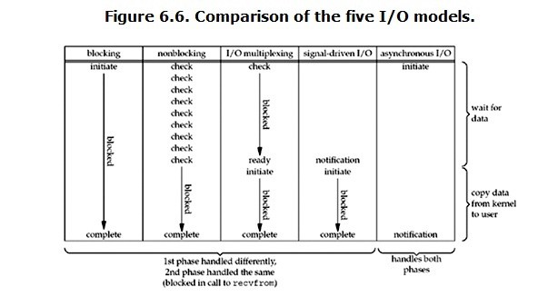

Linux
===

- argc argv optind opterr optopt optarg

  参数argc和argv：

     通常是从main的参数直接传递而来，argc是参数的数量，argv是一个常量字符串数组的地址。
  参数optstring：

     一个包含正确选项字符的字符串，如果一个字符后面有冒号，那么这个选项在传递参数时就需要跟着一个参数。
  外部变量：

  char *optarg：如果有参数，则包含当前选项参数字符串
  int optind：**argv的当前索引值。当getopt函数在while循环中使用时，剩下的字符串为操作数，下标从optind到argc-1**。
  int opterr：这个变量非零时，getopt()函数为“无效选项”和“缺少参数选项，并输出其错误信息。
  int optopt：当发现无效选项字符之时，getopt()函数或返回 \’ ? \’ 字符，或返回字符 \’ : \’ ，并且optopt包含了所发现的无效选项字符。

  > https://www.cnblogs.com/xhg940420/p/7016574.html


- POSIX

  **可移植操作系统接口**（Portable Operating System Interface，缩写为**POSIX**）是 IEEE 为要在各种 UNIX 操作系统 上运行软件，而定义 API 的一系列互相关联的标准的总称，

  当前的POSIX主要分为四个部分：Base Definitions、System Interfaces、Shell and Utilities和Rationale。

  **unistd.h** 是 C 和 C++ 程序设计语言中提供对 POSIX 操作系统 API 的访问功能的头文件的名称。该头文件由 POSIX.1 标准（可移植系统接口）提出，故所有遵循该标准的操作系统和编译器均应提供该头文件。

  对于类 Unix 系统，unistd.h 中所定义的接口通常都是大量针对系统调用的封装（英语：wrapper functions），如 fork、pipe 以及各种 I/O 原语（read、write、close 等等）。

  > https://cloud.tencent.com/developer/ask/26856


- 命令行<, [, ...区别

  在方括号内的表达式(“[” 和 “]”之间的字符)是**可选**的（写命令时要去掉括号）。
  在尖括号内的表达式(“<” 和 “>”之间的字符)是**必须替换**的表达式(而且要去掉括号)。

  省略号表示该选项可以单个或多个


- Unit

  Systemd 可以管理所有系统资源。不同的资源统称为 Unit（单位）。

  

- 进程

  按照进程的功能和运行的程序分类，进程可划分为两大类：

  (1) 系统进程：可以执行内存资源分配和进程切换等管理工作；而且，该进程的运行不受用户的干预，即使是root用户也不能干预系统进程的运行。

  (2) 用户进程：通过执行用户程序、应用程序或内核之外的系统程序而产生的进程，此类进程可以在用户的控制下运行或关闭。

  针对用户进程，又可以分为交互进程、批处理进程和守护进程三类。
  (1) 交互进程：由一个shell终端启动的进程，在执行过程中，需要与用户进行交互操作，可以运行于前台，也可以运行在后台。

  (2) 批处理进程：该进程是一个进程集合，负责按顺序启动其他的进程。  

  (3) 守护进程：守护进程是一直运行的一种进程，经常在linux系统启动时启动，在系统关闭时终止。它们独立于控制终端并且周期性的执行某种任务或等待处理某些发生的事件。例如httpd进程，一直处于运行状态，等待用户的访问。还有经常用的crond进程，这个进程类似与windows的计划任务，可以周期性的执行用户设定的某些任务。

  

- 交换分区

  目前Red Hat（红帽官方）推荐交换分区的大小应当与系统物理内存的大小保持线性比例关系。
  在小于2GB物理内存的系统中，交换分区大小应该设置为内存大小的**两倍**（1.5-2）；
  如果内存大小多于2GB，交换分区大小应该是物理内存大小加上2GB；
  原则上，由于交换分区读写速度比真正内存区慢的多，因此在实际应用中如果不是特别需要应该设置的越小越好。

  

- glibc

  glibc是GNU发布的libc库，即c运行库。glibc是linux系统中最底层的api，几乎其它任何运行库都会依赖于glibc。

  glibc 和 libc 都是 Linux 下的 C 函数库。

  libc 是 Linux 下的 ANSI C 函数库；glibc 是 Linux 下的 GUN C 函数库。


- Shebang (Unix)

  ```shell
  #!interpreter [optional-arg]
  ```

  ```shell
  #!/usr/bin/env sh
  ```
  
  
  
- read 与 select

  read 不加参数，相当于 recv

  当read/recv 返回 0 时，可以确认对方已经关闭 socket 此时socket fd 的读缓冲区中，会一直存在一个概念数据流 EOF，并不可以被读取出来，可以被处理，但是每处理一个 EOF(读出一个 0) 系统会再次在 fd 中产生一个 EOF 并且 EOF 对 select 来说是 ready 状态

  select 可以轮询 读 fd 集合 写 fd 集合 错误 fd 集合，并且可以根据 timeout 作出不同表现，每次 timeout 都一定会唤醒

  select 会每次改变 读集合，改变为下一个状态，这个被认为是历史遗留设计问题

  select 有可能会改变 timeout 作为剩余过气时间，根据内核不同表现不同

  socket fd 有 读缓冲区 和 写缓冲区，因而可以边写边读，应该是并发安全的~~不记得出处了~~

  对应到物理层，双绞线(~~反正就有两条线读/写，是不是双绞线问题不大~~)，读写完全隔离(参见./网络/others.全双工/半双工/单工)

  select 建议搭配 非堵塞 IO，也有安全原因，但尚且不清楚是什么安全原因


- UNIX network IO

  对于一个network io 基本会涉及两个阶段

  - 准备数据
  - 数据从 kernel space 到 user space buffer

  对应五种 IO model:

  - blocking IO
  - nonblocking IO
  - multiplexing(selector)
  - signal-driven IO
  - asynchronous IO

  区别对比：

  

  异步 IO 是两阶段都完成才唤醒，这样的区别就是第二阶段也是不堵塞的，其他的话只是第一阶段不堵塞，但是第二阶段还是要等待，除非多线程(我觉得)

  多路轮询需要两次 system call

  非堵塞就是 如果不能读就返回错误 EWOULDBOLOCK

  > 區別這兩者的關鍵就是**到底是誰在進行真正的I/O**, 如果是主執行緒, 那就是synchronous, 若是衍生出來的子執行緒, 待子執行緒完成I/O operation後回報給主執行緒, 這就是asynchronous.

### NAPI(New API)
是 Linux 中使用 interrupt mitigation 的接口
默认中断，数据量大了就变成 interrupt coalescing
 **The poll function is implemented by the device driver**
这个 poll 并不是我们平时的 poll
是硬件做的比的玩意
主要是 通过中断触发回调
附:
 在 WIN 中，起到同样功能的叫 Interrupt Moderation
 网卡 攒到一定包 或者一定期限 进行 interrupt
 要求并且默认打开
 > https://docs.microsoft.com/en-us/windows-hardware/drivers/network/interrupt-moderation


### epoll kqueue poll 等等
> https://www.zhihu.com/question/20122137 这个很牛啊
> 通常来说select和poll属于I/O multiplexing，而epoll可以算作signal driven I/O
> epoll用红黑树存储，用list存储就绪事件（与select和poll不同，select是bitmap，poll是数组存储）

epoll 主要是给网络IO用的，读正常的文件会直接读到EOF，也就是直接准备好，没必要。有些还会有问题。

### File-system VS mac os VS windows

**Windows**

FAT: FAT12(12 bit represent a block) -> FAT16 -> FAT32(4294967296)


### BPF

伯克利包过滤器（Berkeley Packet Filter）

过滤包

提供 *原始链路层封包* 的收发

可以使网卡工作在混杂模式(如果支持): 这样可以收到网络上的所有包，不管他们的目的地是不是所在主机。

可以用户自定义过滤包函数

BPF支持过滤数据包——用户态的进程可以提供一个过滤程序来声明它想收到哪些数据包。通过这种过滤可以避免从操作系统内核向用户态复制其他对用户态程序无用的数据包，从而极大地提高性能。

### 运行级别与自启动服务管理

/etc/init.d/ 下是可执行文件或脚本
/etc/rc.d/ 下是连接

> 0，1... 6 代表启动级别： 0代表停止，1代表单用户模式，2-5代表多用户模式，6代表重启
> xyyzzzzz 代表启动级别： x代表关闭或者是开启(K/S)，yy代表自启动级别，zzzzzzz是名字

相关命令行：chkconfig、runlevel

### SysV

  > UNIX System V是Unix操作系统众多版本中的一支。它最初由AT&T开发，在1983年第一次发布，因此也被称为AT&T System V。一共发行了4个System V的主要版本：版本1、2、3和4。System V Release 4，或者称为SVR4，是最成功的版本，成为一些UNIX共同特性的源头，例如“SysV 初始化脚本”（/etc/init.d），用来控制系统启动和关闭，System V Interface Definition（SVID）是一个System V如何工作的标准定义。


### 数据模型（LP32 ILP32 LP64 LLP64 ILP64）

> 32位环境涉及"ILP32"数据模型，是因为C数据类型为32位的int、long、指针。而64位环境使用不同的数据模型，此时的long和指针已为64位，故称作"LP64"数据模型。

现今所有64位的类Unix平台均使用LP64数据模型，而64位Windows使用LLP64数据模型

| Data Type |	ILP32 |	LP32 | ILP64 | LP64 | LLP64 |
| --- | --- | --- | --- | --- | --- |
宏定义 |  _  |  _  	|  _  |	__LP64__ | __LLP64__
平台 |	Win32 API / Unix 和 Unix 类的系统 （Linux，Mac OS X）| 	Win16 API	|  |	Unix 和 Unix 类的系统 （Linux，Mac OS X) |	Win64 API
char | 8 |	8 |	8 |	8 |	8
short |	16 |	16 |	16 |	16 |	16
int |	32 |	32 |	64 |	32 |	32
long |	32 |	32 |	64 |	64 |	32
long long |	64 |	64 |	64 |	64 |	64
pointer |	32 |	32 |	64 |	64 |	64

> LP64意思是long和pointer是64位，
> ILP64指int，long，pointer是64位，
> LLP64指long long和pointer是64-bit的，
> ILP32指int，long和pointer是32位的，
> LP32指long和pointer是32位的。

### RTC

实时时钟（Real-time clock，RTC）是指可以像时钟一样输出实际时间的电子设备，一般会是集成电路。

### Reserved code ____xx__

C 保留字段，优点就是不会被覆盖


### 惊群问题

accept() 等待的时候，会是一个链表，然后唤醒的时候全部唤醒，但是我不明白为什么只唤醒一个节点，嗯，所以惊群

2.6之后引入 exclusive 标记，非exclusive在所有exclusive之前，然后唤醒。


### 处理器架构，指令集，汇编语言

处理器架构 => 微架构(Micro-architecture)
处理器指令集 => 架构(Instruction Set Architecture)
汇编语言 => 指令集(Assembly Language)

> X86 (ISA) （指令集架构）（设计规范）
> ——————
> AMD | Intel （微架构）（设计方案的实现）
> ——————
> 具体电路，量子，生物（具体实现）


### C attribute

自定义入口点

```c
__attribute((constructor)) void before_main()  
{  
    printf("%s/n",__FUNCTION__);  
}   

__attribute((destructor)) void after_main()  
{  
    printf("%s/n",__FUNCTION__);  
}  
```


### 内核空转问题

> https://www.zhihu.com/question/23561375

每个 CPU 一个0号进程，一直在跑，调用电源管理，降频，优先度很低。

总体还是通过中断的。

### Leaf Functions

> https://gcc.gnu.org/onlinedocs/gccint/Leaf-Functions.html

不用(依赖)自己的寄存器规则
GCC 可以重排寄存器

#### Pthread

POSIX Threads
是 POSIX 线程标准，定义了创建和操纵线程的一套 API

大概分为四类
- 线程管理
  创建、等待、状态 ...
- 互斥锁
  ...
- 条件变量
  ...
- 使用了互斥锁的线程间的同步管理
  ...
