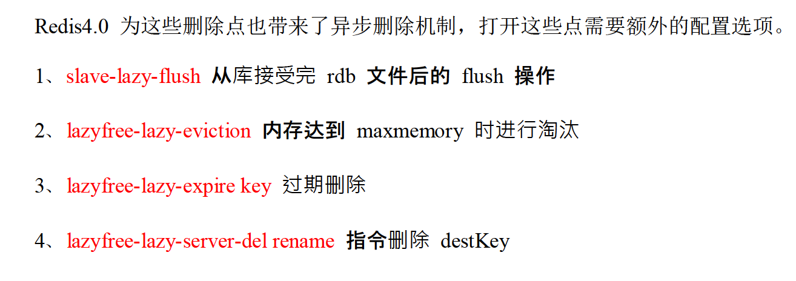
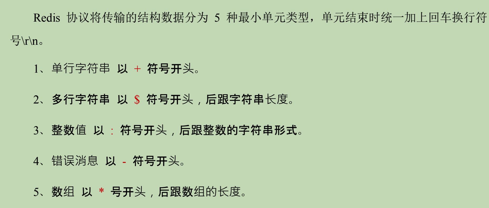
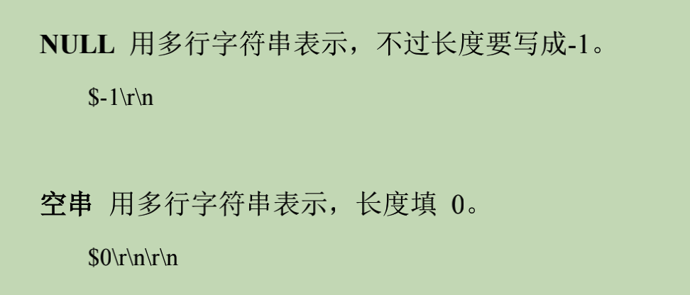
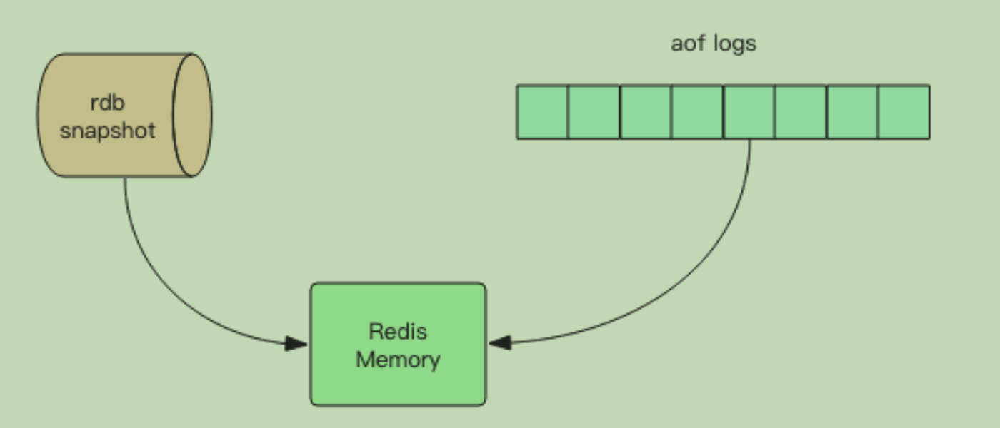
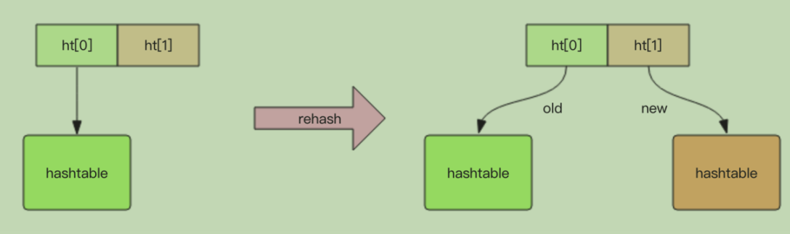

Redis
===

### 基本数据类型

1. string

   Redis 的字符串是动态字符串，是可以修改的字符串，内部结构实现上类似于 Java 的 ArrayList，采用预分配冗余空间的方式来减少内存的频繁分配，如图中所示，内部为当前字 符串实际分配的空间 capacity 一般要高于实际字符串长度 len。当字符串长度小于 1M 时， 扩容都是加倍现有的空间，如果超过 1M，扩容时一次只会多扩 1M 的空间。需要注意的是 **字符串最大长度为 512M**。

2. list

   链表实现，无元素之后自动删除，内存被回收。时间复杂度与链表一致

   `rpush` `lpop` `rpop` `lpush`

   `lrange` `lindex` `llen`

   **ziplist** **quicklist**

3. set

   内部键值对是 **无序的** **唯一的** -> 自动去重

   `sadd` `smembers` `sismember` 

   `scard` `spop`

4. hash

   数组+链表

   value 只能是字符串

   渐进式rehash -> 并不一次迁移，保留新旧两个hash结构，查询同时查询两个hash结构，后续逐渐迁移

   `hset` `hgetall` `hlen` `hmest`

   `hincrby`

5. zset

   保证内部value的唯一性(set)

   为每个value赋予一个score -> 排序权重

   `zadd` `zrange` `zrevrange` `zcard` `zscore` `zrank`

   `zrangebyscoe` `zrem`

   **跳跃列表**


### 容器型数据结构的通用规则

- 容器型数据结构

  list / set / hash / zset

1. create if not exists
2. drop if no elements 
3. expire 时间作用整个对象
4. expire 会覆盖 (**set 会取消**)


### 分布式锁

- setnx 设置锁

  v 2.8 +

  ```bash
  > set lock:xx true ex 5 nx
  ```

- del 解锁

  ```bash
  > del lock:xx
  ```

  

### 延时队列

- zrangebyscore -> 把过期时间当作score 轮询score小于当前时间的 value -> score(0, time.Now().Unix())
- zrem判断是否抢到任务


### 漏斗限流

1. 维护滑动窗口

2. cl.throttle

   ```bash
   > cl.throttle key capacity operations period(seconds) quota
   ```

   返回值

   ```bash
   > 0/1 是否允许
   > 漏斗容量
   > 漏洞剩余空间
   > -1 / 如果拒绝了，多少时间后可重试
   > 多久时间后漏斗完全空出来
   ```

   


### 位图

本质是 byte 数组

1位1bit

位数组是**自动扩展**的

从高到低位*与数组相反*

- getbit/setbit

“零存整取” “整存零取”

- **bitcount** 计数

- bitpos 查找第一个0/1 **可指定范围，但是是字节索引，所以结果只能是8的倍数**

  -> 

- bitfield -> 片段读写

  get、set、incrby

  overflow：

  - wrap 折返
  - fail 报错不执行
  - sat 饱和截断

  只作用一次


### HyperLogLog

提供不精确的去重技术方案，标准误差0.81%

`pfadd` `pfcount` `pfmerge`

稀疏矩阵存储 -> 稠密矩阵


### 非堵塞I/O

能读多少读多少，能写多少写多少

(堵塞: 生产等待消费)


### 近似 LRU

时间戳字段

每次随机 5 个值，删除最旧的，直至低于maxmemory-policy


### 定时任务

维护最小堆，立即处理堆顶，并记录下一个到时时间 timeout


### 懒删除 LAZYFREE

> redis >= 4.0

```bash
> ulink key
> flushdb async (异步)
> flushall async (异步)
```

解决删除(del 命令)大量 key 集合导致的性能堵塞

后台线程异步回收内存

若集合小(内存占用少) 直接执行 del, 等价 del

AOF 也采用异步

其他异步：




### RESP(Redis Serialization Protocal)

Redis 序列化协议






客户端向服务器发送的指令只有一种，多行字符串**数组** （数组，每个元素都是RESP**多行**字符串格式）


### 持久化

- 快照

  全量备份内存数据二进制序列化形式

- AOF日志

  增量备份，内存数据修改指令文本



- COW (copy on write)

  


### **通用数据结构（对象头数据结构）**

占 16 bytes

```cpp
struct RedisObject {
  int4 type; // 4bits 不同对象
  int4 encoding; // 4bits 不同编码方式
  int24 lru; // 24bits
  int32 refcount; // 4bytes 引用计数 0 销毁 回收内存
  void *prt; // 8bytes
}
```


### 字符串的实现

Simple Dynamic String

数据结构：带长度信息的字节数组

不得超过 512 MB

```cpp
struct SDS<T> {
  T capacity; // 容量
  T len; // 长度
  byte flags; // 特殊标识位
  byte[] content; // 内容
}
```

T -> byte/short/int

初始化时 len == capacity -> 都是节约空间

两种存储方式

以 44 字节为界限

内存分配（jemalloc/tcmalloc）单位：2、4、8、16、32、64

- embstr

  body 与对象头保存在一起（一起malloc）

- raw

  不保存在一起（malloc 两次）

```redis
> debug object youStrObject
```

扩容：每次*2，1M后每次1M


### 字典（dict）

redis 内部键值对和过期时间、zset 都要 dict

```cpp
struct RedisDb {
  dict* dict; // 所有键值对 ket:value
  dict* expires; // 所有带过期时间的键值对 key:long(timestamp)
  ...
}
```

```cpp
struct zset {
  dict* dict; // ket:value
  zskiplist* zsl;
}
```

dict 数据结构

渐进式 rehash



