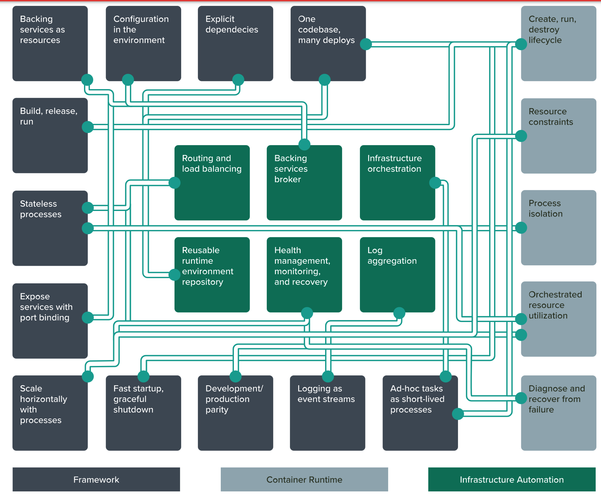

### (SaaS)12-factors

> 这套理论适用于任意语言和后端服务（数据库、消息队列、缓存等）开发的应用程序。

https://12factor.net/zh_cn/

| Factor                                 |                             描述                             |
| :------------------------------------- | :----------------------------------------------------------: |
| Codebase 基准代码                      | One codebase tracked in revision control, many deploys 一份基准代码，多份部署 |
| Dependencies 依赖                      | Explicitly declare and isolate dependencies 显式声明依赖关系 |
| Config 配置                            |       Store config in the environment 在环境中存储配置       |
| Backing services 后端服务              | Treat backing services as attached resources 把后端服务当作附加资源 |
| Build, release, run 构建，发布，运行   |  Strictly separate build and run stages 严格分离构建和运行   |
| Processes 进程                         | Execute the app as one or more stateless processes 以一个或多个无状态进程运行应用 |
| Port binding 端口绑定                  |    Export services via port binding 通过端口绑定提供服务     |
| Concurrency 并发                       |     Scale out via the process model 通过进程模型进行扩展     |
| Disposability 易处理                   | Maximize robustness with fast startup and graceful shutdown 快速启动和优雅终止可最大化健壮性 |
| Dev/prod parity 开发环境与线上环境等价 | Keep development, staging, and production as similar as possible 尽可能的保持开发，预发布，线上环境相同 |
| Logs 日志                              |         Treat logs as event streams 把日志当作事件流         |
| Admin processes 管理进程               | Run admin/management tasks as one-off processes 后台管理任务当作一次性进程运行 |

### 声明式编程

声明式编程（Declarative）命令式编程（Imperative）

面向目的状态编程

对开发者不友好，对使用者 友好

