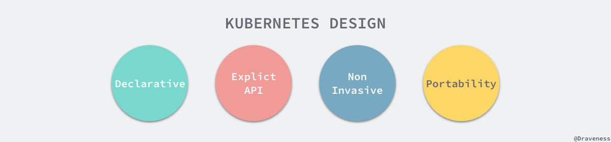

### Resources

```shell
> kubectl api-resources # 查看所有api资源
```

### Feature stages

feature 有三种状态：

- Alpha: 默认不设置，可短期测试
- Beta: 默认设置
- GA: stable，不能关闭

### Obj Name & UID

每个 资源类型 唯一 name

k8s 自动生成 UID

### 设计理念



