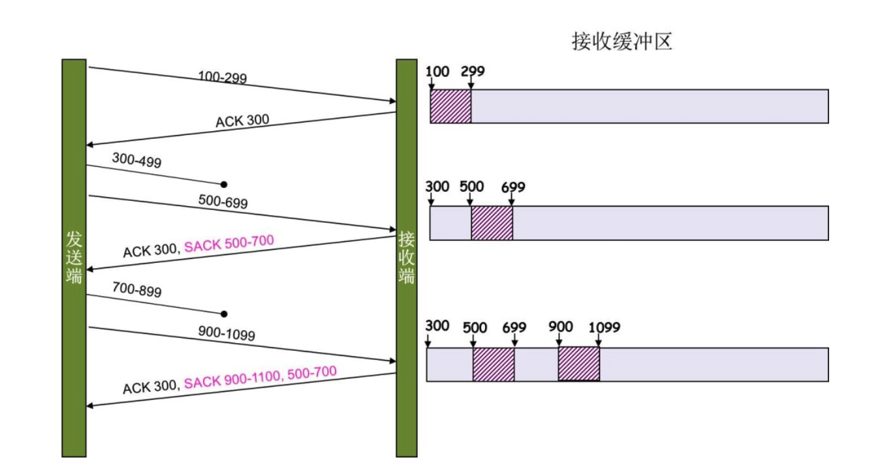

#### 全双工/半双工/单工

**全双工:** 两个方向同时传输，相当于两个单工的结合

**半双工:** 同时只允许一边传输

**单工:** 只允许一边传输

> 集线器只能是半双工的，不可能是全双工的。除非它带有部分交换机的功能。
>
> 全双工的网络必须要使用交换机组网。

#### 比快速重传机制更好的 SACK 方法

RFC 2018

由于快速重传无法确实要重传的数据是哪些，所以引入 SACK 方法

存在于 TCP 头中，发送端可以在同时得知哪些数据到了

需要两边都支持，tcp_sack参数

但是如果不好好使用会引起发送端资源浪费

#### 

#### HSTS
HTTP严格传输安全（HTTP Strict Transport Securit）
是一套由互联网工程任务组发布的互联网安全策略机制。网站可以选择使用HSTS策略，来让浏览器强制使用HTTPS与网站进行通信，以减少会话劫持风险。
HSTS的作用是强制客户端（如浏览器）使用HTTPS与服务器创建连接。服务器开启HSTS的方法是，当客户端通过HTTPS发出请求时，在服务器返回的超文本传输协议（HTTP）响应头中包含Strict-Transport-Security字段。非加密传输时设置的HSTS字段无效

#### Percent-encoding 百分比编码
它有时被称为URL编码。编码由英文字母替换组成：“%” 后跟替换字符的ASCII的十六进制表示。
相关传输方式: `application/x-www-form-urlencoded`

#### FQDN (Fully Qualified Domain Name)
全限定域名：同时带有主机名和域名的名称

##### ACME(Automated Certificate Management Environment)
自动化证书管理环境

#### SOCKS(SOCKet Secure)

SOCKS是**会话层**的协议，无视协议，只转发

主要对比 HTTP 代理，HTTP 代理只代理 TCP，Socks 5支持UDP。作用于会话层(较 HTTP 低层)，速度快。更安全(更多安全的手段)。

**和v2ray的区别**

v2ray 兼容 Socks 5

**VMess**

V2Ray 原创的加密通讯协议，基于 TCP，UDP over TCP，由TCP包装后转发

#### 压测

nethogs/ab/nload/iptraf/netperf/iperf/iftop/netsniff-ng

#### TCP UDP MTU

UDP 最大 64 K，但是一般限制在 548 之间
MTU 1500字节，最小 64 字节

TCP 没有包长度这个区别，完全交给 IP 层分包

> https://blog.csdn.net/caoshangpa/article/details/51530685

#### QUIC

#### SCTP

Stream Control Transmission Protocol 流控制传输协议

2000，RFC4906，3208

针对成帧的消息，message-oriented。发送的是一串 message(byte 的集合)，TCP 是流导向的协议，只是单纯的附加 bytes 到 queue，而 SCTP 每个 message 都有独立的 queue。

- Multi home
  可以有多个路线，做高可用

#### SS7

Signaling System Number 7
七号信令

> https://en.wikipedia.org/wiki/Signalling_System_No._7

#### Qos

Quality of Service
保证数据流性能达到一定的水准

#### IPsec

互联网安全协议 (Internet Protocol Security, IPsec)
透过对IP协议的分组进行 加密和认证 来保护IP协议的网络传输协议族。
