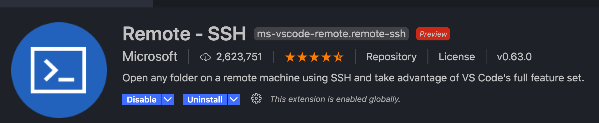
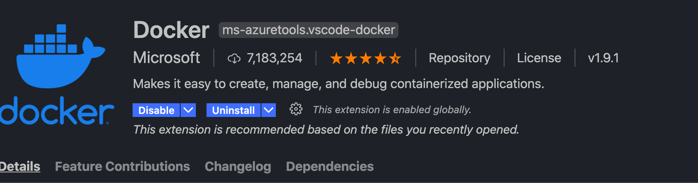

简单的入门服务器部署
===

> 大家可以去飞书看看宋汝阳学长写的，已经写了很多了，和下面有一些重合
>
> 指路：
>
> https://muxi.feishu.cn/docs/doccnmMut8f7GOU7go02Pf3sjQe#9xIwie <-- 特指这个
>
> https://muxi.feishu.cn/docs/doccn4gNerEJelwWHEkmGBoYC3u#


## 一、前置知识

#### 0. 学生机

服务器是很贵的！所以我们用的是便宜的学生机，一般都是 40G HDD 1C 2G

一个月只需要 10 软妹币

系统随便选 centos 或 ubuntu 都可 win 你想用也不拦着

需要注意的区别就是 centos 属于Red Hat 系，所以这个系统的包管理与你们平常用 Debian 系列的 ubuntu、deepin 有所不同

Red Hat 系的包管理是 rpm ，对应 debian 里的 dpkg，yum 对应 apt / apt-get

地域啥的都无所谓

为什么我们需要服务器？

1. 公网IP

   什么是公网IP？什么是内网IP？什么是动态IP？

   公网 IP 就是大家都能访问，且一般不会变

   内网 IP 就是同一内网下可以访问的地址，这个 IP 只在局域网中有效，互相访问通常也就比较快

   动态 IP 一般就是你家里的宽带被分配的 IP 是动态的

2. 一直开着hhh


#### 1. ssh

买到学生机之后，我们怎么用呢，现在买的服务器一般默认提供两种方式，一种是 ssh (Secure Shell) 协议类的，一种是 rdp (RemoteDesktopProtocol) 协议类的

当然后者就是运行图形化界面了，win 平台一般比较常用到，其实用熟了还挺能凑合的嘿嘿嘿

前者也有很多种链接方式，都是基于 ssh 协议的

建议以下方式食用：

```bash
$ ssh root@47.97.74.180 # -p 22 因为默认就是 22 所以就不写了
Password: xxxxx
```

好了，你已经链接上服务器了，达成人生成就操作服务器！

你可以像使用自己电脑一样的使用服务器


#### 2. scp / rsync

如何与服务器通信呢？

scp ！

本地只给一个命令行的话，大家肯定都知道诸如 `cp` `mv` 这种命令

```bash
$ scp -r feishu-bot-test/handler  root@47.97.74.180:~/Documents/feishu-bot-test # 上传
$ scp Documents/planet.muxixyz.com 47.97.74.180:~/Documents/planet.muxixyz.com # 下载
```

`rsync` 就是更高级一些啦，当然现阶段更推荐 `scp`  `rsync`更多的是做同步/增量备份，就不提了

- 觉得太麻烦？

  没关系，我也觉得麻烦，下面会有现阶段可以用的懒方法


#### 3. Let’s Encrypt

大家应该都知道 `https` 吧？

简单来说加密了的 HTTP 的通道，在HTTP的基础上通过传输加密和身份认证保证了传输过程的安全性

当然我们也需要 https

大概有几个步骤

- 阿里云添加 A 记录
- 服务器配置 tls 证书
- 本地测试

Let’s Encrypt 是免费签发证书的机构

这个好像gin也支持这个，但是我懒得测试了

- 如何知道我需要使用 https ?
  1. 小程序强制要求 https
  2. 一站式门户登录的，同时还应该跟你们前端沟通好可逆的加密算法，虽然加了 ssl 的话其实无所谓，目前网络保护最重要的手段就是 https 加密，其他的其实都没啥太大的意义


#### 4. nslookup ping curl / postman

是否配置好了域名？

```bash
$ nslookup planet.muxixyz.com
Server:		202.106.195.68
Address:	202.106.195.68#53

Non-authoritative answer:
Name:	planet.muxixyz.com
Address: 47.97.74.180
```

是否部署成功？

如果你怀疑服务器连不上？可以 ping 一下

```bash
$ ping 47.97.74.180
PING 47.97.74.180 (47.97.74.180): 56 data bytes
64 bytes from 47.97.74.180: icmp_seq=0 ttl=50 time=29.177 ms
64 bytes from 47.97.74.180: icmp_seq=1 ttl=50 time=29.478 ms
^X64 bytes from 47.97.74.180: icmp_seq=2 ttl=50 time=30.048 ms
^C
--- 47.97.74.180 ping statistics ---
3 packets transmitted, 3 packets received, 0.0% packet loss
round-trip min/avg/max/stddev = 29.177/29.568/30.048/0.361 ms
```

当然这都可以通过你 postman 请求是否成功来判断hhh

同理 curl


#### 5. Nginx

nginx就是一个代理工具，当然他可以干好多好多好多事情

基本做的就是简单的转发，会根据配置文件做一些处理，比如加 `header`，拦截请求之类的

比如你的域名是 `planet.muxixyz.com`

前端是 `planet.muxixyz.com/fe/xxx`

然后你就可以指定他访问哪一个文件，就结束了

后端是 `planet.muxixyz.com/api/v1/*`

然后你就指向本地的 xxx 端口就可以了，就转发过去了

**如果你用的是一站式登陆，不要在 `log` 里记录 `request_body` ！**

具体的使用可以看宋汝阳写的，也可以看[官方文档](http://nginx.org/en/docs/)，也可以百度，nginx 用的人很多，不用怕找不到教程，这也是为什么这里不多写的原因

当然在学校的话，可能更多看到的是 `tomcat ` 

其他常见的可能有 `Apache`, `IIS`


#### 6. Docker

啥是 `docker`？

~~删了~~

如果你每创建一个应用，都要部署一次，搞一遍各种东西，那岂不是要累死，而且环境都搞的乱乱的

这个时候你就要用到 docker 了！

容器是完全使用沙箱机制的，所以不用担心搞坏

很方便很好用

虽然以后可能不是 docker，但容器化一定是世界的潮流


#### 7. node npm yarn

其实...好像也不用知道...先略过吧...

后期得证确实不太不需要

> 一些你所不知道的前端知识

- **node**

  这里一般指 `Node.js` 

  > 官网: https://nodejs.org/zh-cn/

  当然不要把 js 和 node 搞混了，js 是脚本语言，和 go 与 go 的关系是不一样的

- **npm**

  `npm` 是 Node.js 标准的软件包管理器。

  > 如何使用: http://nodejs.cn/learn/an-introduction-to-the-npm-package-manager

  其他的就自己玩吧～

  比较常用的就是 install、build、run、start 啥的

  使用时建议使用淘宝源

- **yarn**

  > https://classic.yarnpkg.com/en/

  前端的包的混乱程度远比 go 要乱的多的多

  yarn 是 js 官方出的取代 npm 的一个包管理工具

  大部分情况下 npm 和 yarn 可以互换

  yarn 提供更精细的包管理和版本控制

- 为什么我要提这些？

  部署前端的时候可能会出很多问题，如果我们对前端的东西一无所知，那根本无从下手，也无法和前端交流

  如果你们是安卓/小程序，那就不会有这种顾虑


## 二、 单机

#### 1. 最简单的复现

这个就是将你电脑上的开发环境完整的搬上服务器

流程：

- 上传文件
- 安装 mysql 等需要的服务
- 跑起来
- 测试


#### 2. Docker 容器化

简单来说 docker 就是可以把你的应用和你的环境隔离开

安装：

> https://docs.docker.com/engine/install/centos/  -> centos
>
> https://docs.docker.com/engine/install/ubuntu/ -> ubuntu

~~什么？你说你用deepin？那不好意思我救不了你~~

一般流程：

- 构建

  makefile 或者 go build 啥的

  能 build 成就行

  也就是有可执行的二进制文件

  go build xxxx 也可以

- docker run 跑起来

- 本地测试

命令行使用：

```bash
$ docker build -t work . # 构建镜像
$ docker run docker --network=host -d --name work work # run
$ docker stop work # stop
$ docker rm work # rm
$ docker ps -a # 所有进程
$ docker rmi `docker images | grep  "<none>" | awk '{print $3}'` # 删除空镜像，换句话说就是清一下没用的镜像
```


#### 3. 多平台 及 官方免安装 Node

这里只是提一下，一般不会碰到这种情况，团队内的服务器部署应该尽量避免使用这种方法吧，所以不详细展开

外包 / 并不熟练的 win 平台可以将就一下

在某些极端的情况下，可以使用打包工具生成多平台版本二进制可执行文件

最大的特点就是无需更多的依赖处理

开包即用

免安装 Node 在 node_modules 里会自带 npm，开包即用，安装完 server 之后就可以托管了，或者直接挂代理


#### 4. 使用 VSCode 让你的部署~~有手就行~~更快乐

大家基本流程都懂了，命令行确实帅，但是每次都搞这种确实挺煎熬的

探索了一下，有几个比较大众的插件推荐给大家，可以瞬间简化你就部署过程

1. 

   https://code.visualstudio.com/docs/remote/ssh-tutorial#_connect-using-ssh

   

2. 

一些演示...

接下来就是很简单的了


#### 5. 一些常见的问题

- 时间问题

  你有可能发现数据库里的时区不对

  那么怎么办呢！

  大概率是docker里的时区发生了问题

- docker 拉取镜像慢

  换国内源

  爱换啥换啥，基本是阿里 163，阿里就挺好用的

- docker 镜像大？

  一般正常的 go 服务镜像大约在 600 MB - 2G，确实大，所以记得清理 none 镜像

  可以不用在意，如果真的在意 -> 多重构建 docker 镜像 -> 单一结果可以减少 99%

- 外面连不上服务器 mysql/docker ... ？

  记得开启远程访问

- 上传慢？

  打包。归档或者压缩都可以

  ```bash
  $ tar ...
  $ scp ...
  ```

- 下载/网页加载慢？

  小水管，学生机带宽只有 1 M，满速 125 k/s - 130 k/s，而且你本地还要渲染呢

  api 正常延迟应该在 50 - 200 ms

  ~~太高你就重写吧~~

- 无法使用 github

  很有可能你的服务器上无法使用 github

  通常表现为 clone 极慢

  反正基本就是无法使用 github

  解决办法：不用 github

- nginx 配置文件是否正确？

  ```bash
  $ nginx -t
  nginx: the configuration file /usr/local/etc/nginx/nginx.conf syntax is ok
  nginx: configuration file /usr/local/etc/nginx/nginx.conf test is successful
  ```

  同时你还能得到配置文件的路径

- 其他

  看 log 找 bug

  看官方文档


**Done！**

现在至少在miniProject阶段你已经可以没有阻碍的使用服务器啦！

如果你不碰集群，那么大概一/二/三年内基本就没有问题了！


下面不听也无所谓嘿嘿嘿


## 三、集群

#### 1. K8S

基础和能听懂的原理都讲吐了，这里就不讲了，后面有分享再说吧

这里就给大家分享一个比较简单易懂且形象的文章，理解一下

后面主要讲咋用


#### 2. 在团队里怎么用

首先我们因为服务器太辣鸡了，docker可以好好的跑，但是k8s这种企业级工具还是不太能跑的动，所以用的是k3s，监控是 grafana 的 prometheus，日志是 loki，自建 CVS 平台是 gitea，CI 平台是 Drone CI，Webhook 是飞书，ssl 基本都是 let‘s Encrypt 自动生成的，代理是 treafik

集群的部署步骤：

如果不出问题的话，部署一个服务是很快的

- 构建镜像

  a. 如果这个是一个新业务

  - 迁移团队 gitea
    1. 阿里云创建镜像仓库
    2. 使用 root 账户在 gitea 上创建你代码的同步仓库
    3. 新增 .drone.yml
    4. 命令行添加上游仓库
    5. 去 drone ci 查看可激活的仓库，找到自己的，激活
    6. 打一遍 tag
    7. 等飞书群构建结果，也可自己看，飞书更多是不是你亲自的情况，比如让你的前端执行上面的步骤

  - 不迁移
    1. 阿里云创建镜像仓库
    2. 阿里云添加构建规则
    3. 阿里云手动构建

  b. 如果这不是一个新业务

  - 照着前人的搞，或者迁移 gitea 重新搞

- 修改配置文件

  - 在集群上新建/找到你的服务文件夹
  - 修改文件
    - deployment.yaml -> d.yaml
    - svc.yaml -> s.yaml
    - Ingress.yaml -> i.yaml
  - 改你的镜像版本

```bash
$ kubectl apply -f xxx
$ kubectl delete -f xxx
$ kubectl describe pods xxxx -n ns
$ kubectl logs xxx -n ns
$ kubectl get pods -A
```

这段时间应该也不会持续太久，MAE出来之后就都不用了，所以不细讲了

这里再额外讲一下 CI

CI 就是持续集成，它属于开发人员的自动化流程。成功的 CI 意味着应用代码的新更改会定期构建、测试并合并到共享存储库中。

