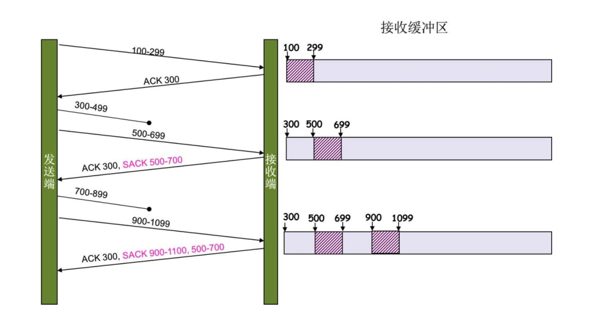

### 全双工/半双工/单工

**全双工:** 两个方向同时传输，相当于两个单工的结合

**半双工:** 同时只允许一边传输

**单工:** 只允许一边传输

> 集线器只能是半双工的，不可能是全双工的。除非它带有部分交换机的功能。
>
> 全双工的网络必须要使用交换机组网。

### 比快速重传机制更好的 SACK 方法

RFC 2018

由于快速重传无法确实要重传的数据是哪些，所以引入 SACK 方法

存在于 TCP 头中，发送端可以在同时得知哪些数据到了

需要两边都支持，tcp_sack参数

但是如果不好好使用会引起发送端资源浪费

### 

### HSTS
HTTP严格传输安全（HTTP Strict Transport Securit）
是一套由互联网工程任务组发布的互联网安全策略机制。网站可以选择使用HSTS策略，来让浏览器强制使用HTTPS与网站进行通信，以减少会话劫持风险。
HSTS的作用是强制客户端（如浏览器）使用HTTPS与服务器创建连接。服务器开启HSTS的方法是，当客户端通过HTTPS发出请求时，在服务器返回的超文本传输协议（HTTP）响应头中包含Strict-Transport-Security字段。非加密传输时设置的HSTS字段无效

### Percent-encoding 百分比编码
它有时被称为URL编码。编码由英文字母替换组成：“%” 后跟替换字符的ASCII的十六进制表示。
相关传输方式: `application/x-www-form-urlencoded`

### FQDN (Fully Qualified Domain Name)
全限定域名：同时带有主机名和域名的名称

#### ACME(Automated Certificate Management Environment)
自动化证书管理环境
